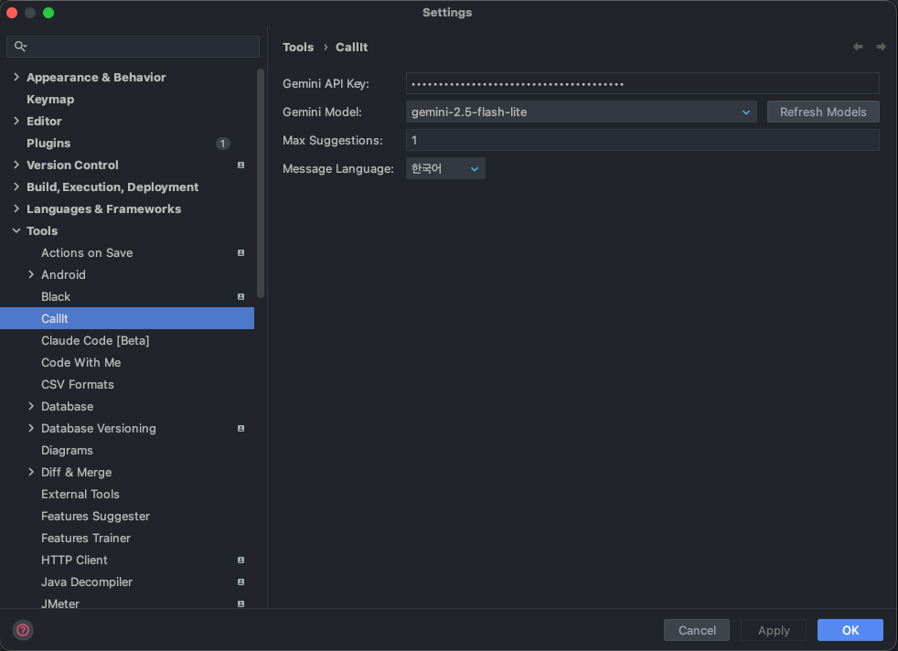
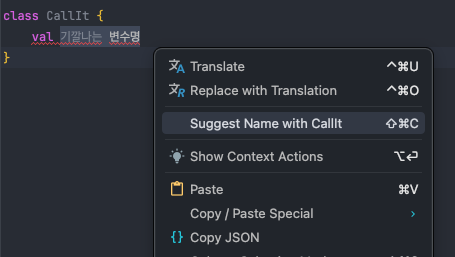
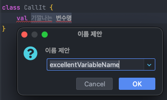

이 포스팅은 [Jetbrains CallIt Plugin](https://plugins.jetbrains.com/plugin/29428-callit)에 대한 설명을 담고 있습니다

---

## Call It 플러그인이란?

Jetbrains 기반 IDE 에서 사용할 수 있는 AI 변수명 생성 플러그인입니다 
Gemini API Key를 입력하여 빠른 변수명 작명이 가능합니다

### 지원 기능 (1.0 기준)

* 최신 Gemini 모델 사용 가능
* 5가지 다국어 지원
* 프로그래밍 언어 감지하여 맞춤 추천
* 동시 n개 변수명 추천

### 지원 IDE

Android Studio, AppCode, Aqua, CLion, Code With Me Guest, DataSpell, DataGrip, JetBrains Gateway, GoLand, IntelliJ IDEA, JetBrains Client, MPS, PhpStorm, PyCharm, Rider, RubyMine, RustRover, WebStorm, Writerside

## 플러그인 다운로드

[Jetbrains CallIt Plugin](https://plugins.jetbrains.com/plugin/29428-callit)

IDE plugin 화면에서도 찾아보실 수 있습니다

## 설정

Settings > Tools > CallIt > Gemini API Key 입력 > 확인

* Gemini API Key: google ai studio에서 발급받은 api key
* Gemini Model: 사용 가능한 모델들
* Max Suggestions: 추천 내역 수  (1로 설정 시 즉시 적용)
* message Language: 설정 언어

## 사용법

변경하고 싶은 문장 드래그 우클릭 > Suggest Name with CallIt 클릭

원하는 제안 선택 후 OK (Max Suggestions가 1이면 아래 창은 뜨지 않습니다)

## 마치며

회사에서 회계 용어들을 변수명으로 지어야 하다 보니 머리를 싸매는 일이 많아졌습니다 
이 기능을 하는 플러그인이 이미 많이 존재하겠지만 직접 만들고 싶어 간단하게 구현해본 프로젝트입니다

만들어보면서 플러그인에 구성 방식과 구현 방법 등 어떻게 흘러가는지 알 수 있는 좋은 계기가 되었습니다

---