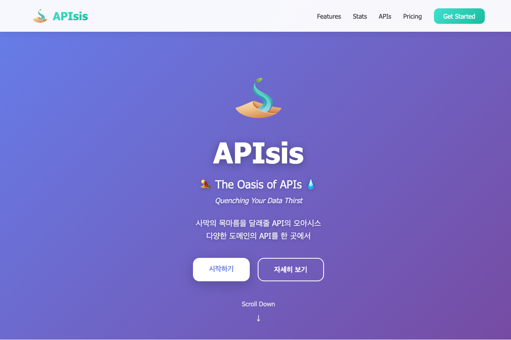
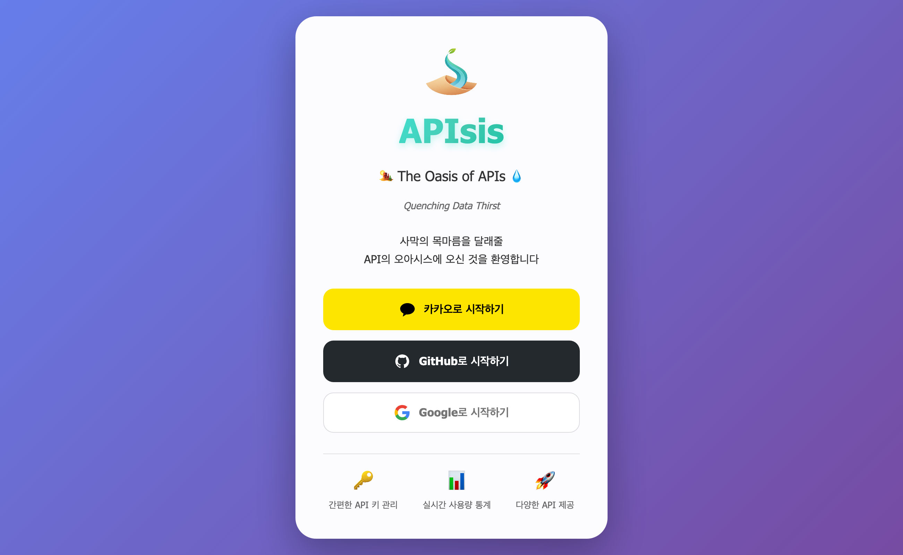
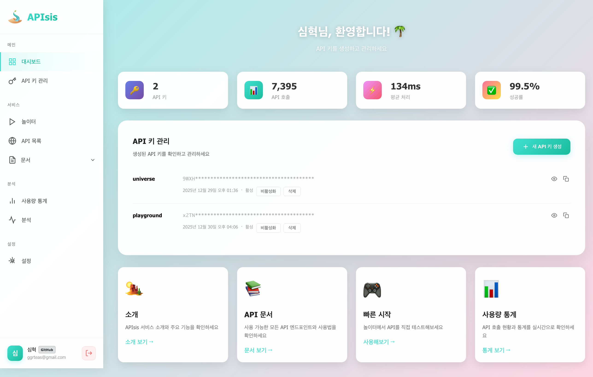

이 포스팅은 [APIsis](https://apisis.dev)에 대한 설명을 담고 있습니다 ([github](https://github.com/hyuck0221/apisis))

---

## APIsis 란?

생활 속 다양한 데이터를 API 형태로 제공해주는 openAPI 서비스 
API 서버, 키 관리 페이지가 하나의 서버로 실행됩니다  
또한 모든게 오픈소스로 도커 파일이 제공되어 API 서버를 로컬에 띄워 내부에서 사용할 수도 있습니다

## 구성

### API

관리중인 API들을 제공하는 서버입니다 
API Key를 통해 계정 인증을 하고 라이센스에 맞게 API 별 사용량을 제공합니다

### 관리 페이지 API

제공용 API가 아닌 내부 관리 페이지 전용 API 입니다  
계정 관리와 사용량 통계 및 분석 등 호출에 필요한 키를 관리하는 데 중점인 API 이며, 사용자 입장에선 사용하지 않는 내부용 API입니다

계정의 경우 총 3가지(구글, github, 카카오)의 oauth2 로그인을 지원합니다 
이메일 계정이 같을 경우 하나의 계정으로 판별되며 계정 별 라이센스를 가질 수 있습니다

라이센스는 xxxx-xxxx-xxxx-xxxx 형태의 코드를 가지고 있으며, 플랜 별로 만료일과 사용량이 달라집니다  
라이센스는 크게 4가지로 나눠져 있으며 EXTRA 플랜을 제외하곤 모두 월별, 연별 만료일 플랜이 존재합니다 

* BASIC: 라이센스가 없는 사용량보단 훨씬 많은 사용량을 제공하나 많진 않은 플랜
* PRO: 실 사용에 문제 없는 사용량을 제공하는 플랜
* ENTERPRISE: 대규모 운영 환경 사용에 문제 없는 사용량을 제공하는 플랜
* EXTRA: 무제한 플랜

라이센스는 계정 당 하나만 소유할 수 있고 라이센스 자체를 삭제할 순 없습니다  
계정에서 라이센스 해제는 가능하나 다른 계정에서 해당 코드를 적용하면 적용할 수 있는 구조로 설계되어 있습니다

### MCP 

자체 MCP 서버도 자동 실행되어 SSE 방식으로 MCP 연결이 가능합니다  
API 정보들을 AI에게 제공해주어 바이브 코딩 시 API 연결에도 유용하게 사용할 수 있습니다

### 최초 실행 데이터 세팅 프로세스

APIsis Application 최초 실행 시 데이터베이스에 데이터 세팅이 필요합니다  
이를 자동화 하기 위해 자동 데이터 세팅 프로세스가 설계되었으며 서버 실행 시 데이터가 없는 기능에 한하여 실행됩니다

데이터 별로 처리 방식이 모두 다릅니다. 현재까지의 데이터는 아래와 같이 처리됩니다
* 방탈출
  * 방식: 외부(빠방) API 호출
  * 프로세스 시점: 방탈출 table에 데이터가 하나도 없을 경우
  * 시나리오: Application 실행 > 방탈출 table select > (비어있을 경우) > 빠방 API 호출 (Paging) > DB insert > 반복
* 법정동 코드 
  * 방식: excel 파싱
  * 프로세스 시점: 법정동 코드 table에 데이터가 하나도 없을 경우
  * 시나리오: Application 실행 > 법정동 코드 table select > (비어있을 경우) > /excel/areacode_01.xlsx 파싱 > DB insert
* 로또
  * 방식: 외부 API 호출
  * 프로세스 시점: 로또 table에 데이터가 하나도 없을 경우
  * 시나리오: Application 실행 > 로또 table select > (비어있을 경우) > 로또 API 호출 > DB insert > 반복

### 데이터 업데이트 스케줄러

최신 데이터 제공을 위해 특정 데이터들은 스케줄러로 데이터 업데이트를 진행합니다
* 방탈출
  * 데이터 추가
    * 실행주기: 매일 오전 1시
    * 프로세스: 최근 빠방에 등록된 방탈출 카페/테마 insert
  * 데이터 업데이트
    * 실행주기: 매일 오전 3시
    * 프로세스: 매일 500개 치 테마 update. ref_id 기준 1~500, 다음날 501~1000 이런식으로 매일 500개씩 업데이트 하여 별점과 운영 여부 등 데이터를 업데이트
* 로또
  * 실행주기: 매주 토요일 오후 9시
  * 프로세스: 최근 공개된 로또번호 insert

### 관리 페이지

패키지에 html도 포함되어 있어 서버 실행 시 관리 페이지도 함께 띄워집니다 
서버 도메인 경로로 접속 시 랜딩페이지가 표시됩니다

총 3가지의 oauth2 로그인을 지원합니다  
(직접 서버 실행 시 별도의 oauth 설정이 필요합니다)

로그인 후 접속하면 대시보드가 표시됩니다 
전체적인 통계와 API 키 관리 그리고 여러가지 가이드들이 제공됩니다

* API Key 관리: 대시보드보다 더욱 자세한 키 별 통계도 확인할 수 있습니다
* 놀이터: 서버에 있는 API들을 직접 호출해볼 수 있는 화면입니다. 생성한 API Key로 직접 호출해보며 결과를 바로 확인해보실 수 있습니다 (사용량 소모됨)
* API 목록: 서버에 있는 API들을 찾아볼 수 있는 화면입니다
* 문서: API들의 상세한 request, response 정보를 볼 수 있습니다
* 사용량 통계: API 호출에 추이를 그래프 등 여러 지표로 제공합니다 
* 분석: 사용량 통계를 베이스로 AI가 사용 현황 보고서를 작성해줍니다
* 설정: 여러 설정들을 관리합니다. 라이센스, 분석, 데이터 삭제 등 옵션을 제공합니다

## 마치며

openAPI 서버를 운영해보니 몇몇 개인 프로젝트에도 도입을 해봤습니다 
미리 필요한 데이터를 APIsis에 등록해두고 프로젝트에 AI로 연결해달라 하면 뚝딱 연결해주는게 생각보다 편하네요 
물론 개인 프로젝트에서 직접 연결해서 써도 되지만, 범용적으로 쓸 수 있게 미리 설계해두면 나중에 유용하게 쓰일 것으로 예상됩니다 (사실상 나만의 API 게이트웨이)

개인 프로젝트 중 완성도 높은 프로젝트가 아닐까 싶습니다  
무엇보다 서비스 이름이 너무 마음에 드는것도 한 몫 하네요. API oasis... 헤헤헤헤

---